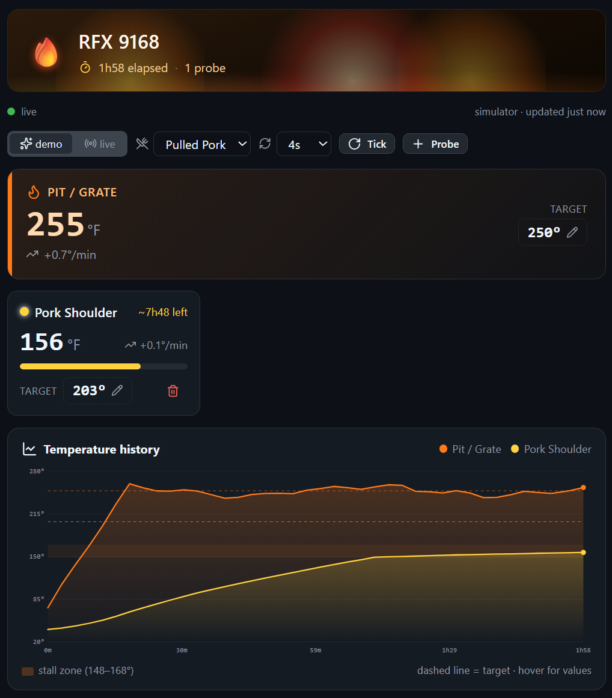

# ThermoWorks Canvas

Monitor your live ThermoWorks cooks inside the GitHub Copilot app: an animated fire-vibe dashboard with real-time probe temps, interactive temperature graphs, target tracking, time-to-done estimates, and high/low alarm states. Pick any of your devices/sessions to watch. Runs a realistic cook simulator out of the box (demo mode) or pulls live device data straight from the ThermoWorks SDK (live mode), with an in-canvas sign-in.



A GitHub Copilot App **canvas extension** built with the
[`create-canvas-app`](https://github.com/jongio/skills/tree/main/skills/create-canvas-app) skill from
[jongio/skills](https://github.com/jongio/skills). The agent and the user share
the same live cook state through the same action handlers; the view renders with
Preact + htm and a vendored kit — no build step, no `package.json`.

## Install

In the **GitHub Copilot app**, just say:

```text
install thermoworks canvas jongio/thermoworks
```

Then open it and say **"watch my cook"** — it opens in demo mode, and you can
sign in from the canvas to switch to your live devices.

Or install it manually by copying this folder into `.github/extensions/thermoworks`
(in-repo), `$COPILOT_HOME/extensions/thermoworks` (personal), or
`$COPILOT_HOME/session-state/<sessionId>/extensions/thermoworks` (current session
only), then run `extensions_reload` and open it with `open_canvas`
(`canvasId: "thermoworks"`).

## What it does

- **🔥 Animated fire-vibe dashboard** — flickering flames, rising embers, and a
  glowing hero that pulses red when the pit goes into alarm.
- **Live pit + probe gauges** — big tabular readouts, rate of change (°/min),
  per-probe progress bars, and **time-to-done estimates** from the recent slope.
- **Interactive temperature graph** — a hand-built SVG multi-line chart with
  per-channel target lines, the **148–168°F evaporative "stall" band**, area
  fills, a pulsing "now" marker, and a hover crosshair + tooltip showing every
  channel's temperature at that moment.
- **🤖 Ask the Pit Master** — chat with "Smokey", an AI BBQ expert powered by the
  host model (no API keys). Every answer is **grounded in your live temps**,
  targets, rates and ETAs, so the advice is specific to *this* cook — the stall,
  when to wrap, doneness, food safety, timing, and more. One-tap suggestion chips
  to start.
- **High/low alarm states** — meat probes flag when they hit target (with a
  "READY 🍖" celebration); the pit flags when it drifts too hot or cold.
- **Inline targets** — click any target temperature to edit it in place.

## 🤖 Ask the Pit Master

The headline, novel feature: **Smokey**, an AI pit master that lives in the canvas
and is **grounded in your live cook data**. Unlike a generic chatbot, every reply
is built from a fresh snapshot of *this* cook — the real pit/probe temps, rate of
change, target gaps, and time‑to‑done estimates on screen — so the guidance is
specific and actionable (diagnosing the stall, when to wrap, doneness, food
safety, timing).


- **Grounded, not generic.** The handler builds a live cook summary and pins the
  output shape, so Smokey cites your real numbers instead of guessing.
- **No API keys.** Uses the GitHub Copilot host model (`ctx.ai`) — a silent,
  no‑tools query that never leaks into the conversation history.
- **Shared with the agent.** `ask_coach` is one action driven by both the UI
  (suggestion chips + free text) and the Copilot agent, over the same state.

## Two data modes

| Mode | Source | Notes |
| --- | --- | --- |
| **demo** (default) | a built-in cook **simulator** | Pit oscillates around its setpoint; meat probes rise toward target through a realistic stall. Works with zero credentials — always demoable. Opens pre-seeded with ~2 hours of brisket history so the graph is alive on first paint. |
| **live** | the **ThermoWorks SDK** (direct) | Calls `thermoworksCloud.getDevices()` / `getAllDeviceChannels()` straight from the locally-built SDK — **no subprocess, no CLI, no npx**. Channels named pit/grate/ambient become the pit; the rest become meat probes. |

### Devices & sessions

Each ThermoWorks device runs its own cook session. In live mode a **device /
session picker** lets you watch **any** of them — pick a single device's session,
or **All** to see every device's channels on one graph (channel names are
prefixed with the device when viewing all). The picker shows each session's
online status and channel count.

### Signing in — no terminal required

Switching to **live** mode shows an in-canvas **sign-in card**: enter your
ThermoWorks Cloud email + password and click **Connect**. Credentials are passed
straight to the SDK and held **in memory for the session only** — never written
to disk by the canvas. If you've already run `thermoworks auth login` (OS
keychain) or set `THERMOWORKS_EMAIL` / `THERMOWORKS_PASSWORD`, the canvas detects
it (best-effort keychain read) and skips the form. A **"Prefer the CLI?"** link
drives the agent to open a terminal and run `thermoworks auth login` for you.

The SDK is resolved from the locally-built `packages/sdk/dist` (walked up from the
extension), falling back to a `thermoworks-sdk` dependency for a standalone install.

## Actions (the agent and the UI share every one)

`refresh` · `set_mode` · `connect_live` · `sign_in` · `sign_out` ·
`select_device` (pick a device/session, or `all`) · `open_terminal_login` ·
`start_cook` (presets: brisket, pork, ribs, chicken, turkey, steak) ·
`set_pit_target` · `set_probe_target` · `rename_probe` · `add_probe` ·
`remove_probe` · `set_auto_refresh` · `ask_coach` (chat with the pit master) ·
`clear_chat` · `summary` (text recap for the agent: temps, targets, rates, ETAs,
alarms).

## Screenshots

| Live dashboard (two probes) | Interactive temperature graph |
| --- | --- |
|  |  |

## Layout

```text
extension.mjs   the ONLY file that imports the Copilot SDK (thin adapter)
canvas.mjs      cook engine: state, simulator, live SDK integration, pit-master chat, actions (SDK-free of the *Copilot* SDK)
canvas-kit/     vendored kit (copied verbatim; do not edit)
web/index.html  shell + BBQ fire theme (built on /kit/theme.css)
web/app.mjs     Preact view: fire header, gauges, SVG graph
test/smoke.test.mjs  boots the runtime over HTTP and exercises the cook actions
```

## Validate

```bash
node test/smoke.test.mjs
```

## Keeping the kit current

`canvas-kit/` is a vendored snapshot of the
[`create-canvas-app`](https://github.com/jongio/skills/tree/main/skills/create-canvas-app) `kit/`. Re-sync it with
the skill's `scripts/sync-kit.mjs`, and gate drift in CI with
`scripts/check-kit-freshness.mjs`.
