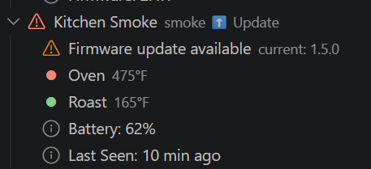

# 🔥 ThermoWorks Tools

[](https://github.com/jongio/thermoworks/actions/workflows/ci.yml)
[](https://www.npmjs.com/package/thermoworks)
[](https://www.npmjs.com/package/thermoworks-sdk)
[](https://marketplace.visualstudio.com/items?itemName=jongio.thermoworks)
[](https://opensource.org/licenses/MIT)
[](https://nodejs.org)

> **Disclaimer:** This project is not affiliated with, endorsed by, or connected to [ThermoWorks](https://www.thermoworks.com/) in any way. It is an unofficial, community-built tool created by ThermoWorks customers for personal use.

See live temperatures from your ThermoWorks Cloud devices in the terminal, GitHub Copilot CLI statusline, VS Code status bar, or a full device panel — with color-coded alarm alerts and firmware update notifications.

---

## Products

### 🔥 VS Code Extension

Full sidebar device panel + status bar integration. See all your devices, channels, battery, firmware status, and alarm states embedded in your editor.


**Install:** Search "ThermoWorks" in VS Code Extensions, or get it from the [Marketplace](https://marketplace.visualstudio.com/items?itemName=jongio.thermoworks).

### ⌨️ CLI + Copilot Statusline

Live temperatures in your terminal footer while you code. Interactive wizard to pick devices and channels.


**Install:** `npx thermoworks`

### 🛠️ SDK

Node.js SDK for programmatic access — build your own dashboards, alerts, or automations with full access to devices, channels, events, archives, calibration data, and more.

**Install:** `npm install thermoworks-sdk`

---

## Key Features

### 🚨 Temperature Alerts

Instant visual alarms when temperatures cross thresholds — red for too high, blue for too low. VS Code blinks the status bar; the CLI uses ANSI color codes.


### ⬆️ Firmware Update Alerts

Automatically detects outdated device firmware by comparing against the latest version from ThermoWorks Cloud. Orange warning visible at every tree level — device folder, device node, and expanded details.



### 🔔 Activity Bar Badge

The fire icon in the VS Code Activity Bar shows a badge count of devices with active alarms — you'll know something needs attention without even opening the panel.

### 📊 Per-Channel Selection

Pick averages or individual channels for multi-probe devices like the Signals 4-channel or Smoke 2-channel.

### 🔐 Secure Credential Storage

Credentials stored in the OS keychain (macOS Keychain, Windows Credential Vault, libsecret). Sign in once — CLI and VS Code share access. Environment variables (`THERMOWORKS_EMAIL` / `THERMOWORKS_PASSWORD`) supported for headless environments.

### 🔗 Cloud Dashboard Link

One-click link to [cloud.thermoworks.com](https://cloud.thermoworks.com) from within the VS Code panel.

### 🎬 Demo Mode

Test alarm styling and take screenshots without real credentials:

```bash
# CLI one-shot demo
npx thermoworks demo high    # red text
npx thermoworks demo low     # blue text
npx thermoworks demo normal  # no color

# Auto-cycling statusline demo
npx thermoworks copilot setup --demo
```

In VS Code: Command Palette → **ThermoWorks: Demo (Simulate Alarm)** — populates the full panel and status bar with fake devices.

---

## Quick Start

```bash
# Sign in to ThermoWorks Cloud
npx thermoworks auth login

# List your devices
npx thermoworks devices

# Run the Copilot statusline setup wizard
npx thermoworks copilot setup
```

For command details, see the [CLI reference](docs/cli-reference.md).

---

## Packages

| Package | Description |
|---------|-------------|
| [`thermoworks`](https://www.npmjs.com/package/thermoworks) | CLI for authentication, Copilot statusline setup, device listing, and demo mode |
| [`thermoworks-sdk`](https://www.npmjs.com/package/thermoworks-sdk) | Node.js SDK for programmatic access to ThermoWorks Cloud |
| [ThermoWorks for VS Code](https://marketplace.visualstudio.com/items?itemName=jongio.thermoworks) | Extension with status bar, device panel, alarm indicators, and firmware alerts |

## Documentation

- [CLI Reference](docs/cli-reference.md) — all commands, flags, and options
- [API Reference](docs/api-reference.md) — ThermoWorks Cloud Firestore REST API
- [VS Code Extension](packages/vscode/README.md) — panel, status bar, alarms, firmware detection

## Development

This repository uses `pnpm` workspaces.

```bash
# Install dependencies
pnpm install

# Lint the monorepo
pnpm lint

# Run tests
pnpm test

# Build all packages
pnpm build

# Type-check all packages
pnpm typecheck
```

## Agent Skills

This project includes [GitHub Copilot agent skills](https://docs.github.com/en/copilot) in `.github/skills/` that help AI coding assistants work with the codebase:

| Skill | Description |
|-------|-------------|
| `thermoworks` | Integration guide for reading temperatures, monitoring alarms, and using the CLI |
| `thermoworks-dev` | Development guide for adding features, understanding conventions, and building |

Skills are auto-discovered by GitHub Copilot and activated when relevant to your task.

## Skill Evaluation (Vally)

Eval suites in `evals/` validate that agent skills produce correct guidance, powered by [`@microsoft/vally`](https://aka.ms/vally):

```bash
# Validate eval specs (fast, no execution)
pnpm eval:lint

# Run smoke suite
pnpm eval:smoke

# Run full evaluation
pnpm eval:full
```

## License

MIT
