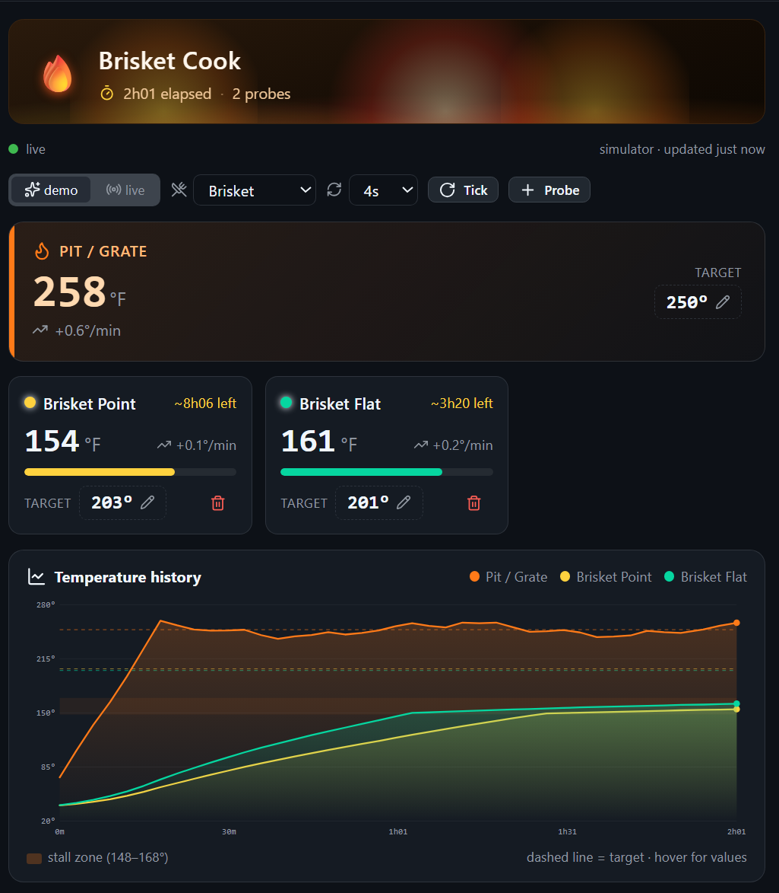
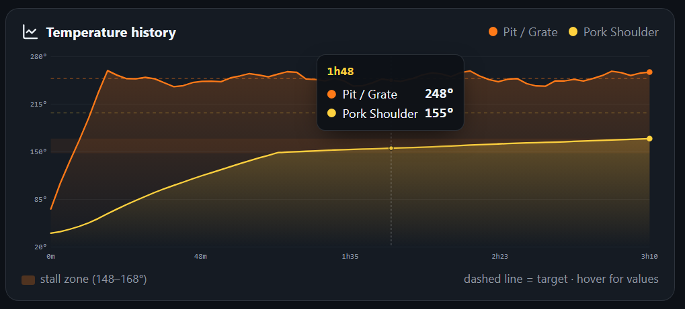
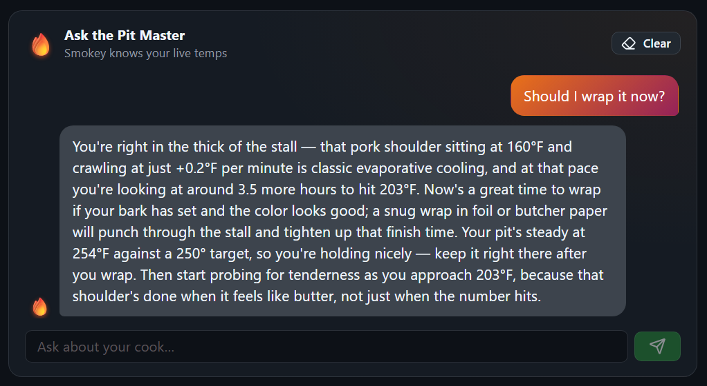

# 🔥 ThermoWorks Tools

[](https://github.com/jongio/thermoworks/actions/workflows/ci.yml)
[](https://www.npmjs.com/package/thermoworks)
[](https://www.npmjs.com/package/thermoworks-sdk)
[](https://marketplace.visualstudio.com/items?itemName=jongio.thermoworks)
[](https://opensource.org/licenses/MIT)
[](https://nodejs.org)

> **Disclaimer:** This project is not affiliated with, endorsed by, or connected to [ThermoWorks](https://www.thermoworks.com/) in any way. It is an unofficial, community-built tool created by ThermoWorks customers for personal use.

See live temperatures from your ThermoWorks Cloud devices in the GitHub Copilot app canvas, terminal, GitHub Copilot CLI statusline, VS Code status bar, or a full device panel — with color-coded alarm alerts and firmware update notifications.

---

## 🆕 ThermoWorks Canvas for the GitHub Copilot app

Monitor your live cooks **inside the GitHub Copilot app** — an animated, fire-vibe
canvas with real-time probe temps, interactive temperature graphs, target
tracking, time‑to‑done estimates, high/low alarms, and an AI **pit master** you
can chat with. Pick any of your devices/sessions to watch, or explore the
built‑in cook simulator with zero setup.



### Install in the GitHub Copilot app

In the GitHub Copilot app, just tell it:

```text
install thermoworks canvas jongio/thermoworks
```

Then open it and say **"watch my cook"** (or pick a device). It opens in **demo
mode** out of the box — sign in from the canvas to switch to your live devices.
No terminal required.

> Built with the [`create-canvas-app`](https://github.com/jongio/skills/tree/main/skills/create-canvas-app) skill
> from [jongio/skills](https://github.com/jongio/skills). See the
> [canvas README](.github/extensions/thermoworks/README.md) for details.

**Highlights**

- 🔥 Animated fire dashboard — flickering flames, rising embers, alarm pulse.
- 📈 Interactive SVG graph — per‑channel target lines, the 148–168°F stall band, hover crosshair + tooltip.
- 🍖 Live gauges — rate of change, progress bars, time‑to‑done ETAs, "READY" celebration.
- 🤖 [Ask the Pit Master](#-ask-the-pit-master) — an AI BBQ expert grounded in your live temps.
- 🔌 In‑canvas sign‑in — connect to ThermoWorks Cloud without a console; pick any device/session, or watch them all.
- 🎬 Demo mode — a realistic cook simulator that works with zero credentials.



### 🤖 Ask the Pit Master

The canvas ships with **Smokey**, an AI pit master you can chat with right next to
your cook — the part nothing else here does. Every answer is **grounded in your
live cook data**: it reads the actual pit and probe temps, rate of change, target
gaps, and time‑to‑done estimates on screen, so the advice is specific to _this_
cook — diagnosing the stall, when to wrap, doneness, food safety, and timing.



- **Grounded, not generic.** Smokey is handed a live snapshot of your cook, so it
  cites your real numbers ("your flat at 160°F, climbing +0.2°F/min, ~3.5h out").
- **No API keys.** It uses the GitHub Copilot app's own model — nothing to
  configure, no separate account.
- **Shared with the agent.** The same chat is driveable by you (one‑tap
  suggestion chips or free text) and by the Copilot agent, over the same state.

---

## Products

### 🔥 VS Code Extension

Full sidebar device panel + status bar integration. See all your devices, channels, battery, firmware status, and alarm states embedded in your editor.


**Install:** Search "ThermoWorks" in VS Code Extensions, or get it from the [Marketplace](https://marketplace.visualstudio.com/items?itemName=jongio.thermoworks).

### ⌨️ CLI + Copilot Statusline

Live temperatures in your terminal footer while you code. Interactive wizard to pick devices and channels. 19 commands for device monitoring, alarms, sessions, data export, and more.


**Install:** `npx thermoworks`

### 🌐 Web Dashboard

Real-time temperature dashboard with Recharts history graphs, alarm color coding, light/dark theme, and public share viewer — all in the browser. Built with React 19, Vite, and Tailwind CSS.

**Live:** [jongio.github.io/thermoworks](https://jongio.github.io/thermoworks/)

**Run locally:**

```bash
# Clone and start the dev server
git clone https://github.com/jongio/thermoworks.git
cd thermoworks && pnpm install
pnpm --filter thermoworks-web dev
```

### 🛠️ SDK

Node.js SDK for programmatic access — build your own dashboards, alerts, or automations with full access to devices, channels, events, archives, calibration data, and more.

**Install:** `npm install thermoworks-sdk`

### 🤖 MCP Server

Model Context Protocol server that exposes your ThermoWorks device data to AI assistants like GitHub Copilot, Claude, and ChatGPT.

**Start:**

```bash
# Via npx (no install needed)
npx thermoworks mcp start

# Or if installed globally
thermoworks mcp start
```

---

## Quick Start

```bash
# Sign in to ThermoWorks Cloud
npx thermoworks auth login

# List your devices with channel readings
npx thermoworks devices

# Watch temperatures live (auto-refresh)
npx thermoworks watch

# Run the Copilot statusline setup wizard
npx thermoworks copilot setup
```

For command details, see the [CLI reference](docs/cli-reference.md).

---

## Feature Highlights

### 🚨 Temperature Alerts

Instant visual alarms when temperatures cross thresholds — red for too high, blue for too low. VS Code blinks the status bar; the CLI uses ANSI color codes.


### ⬆️ Firmware Update Alerts

Automatically detects outdated device firmware by comparing against the latest version from ThermoWorks Cloud. Orange warning visible at every tree level — device folder, device node, and expanded details.


### 📊 Per-Channel Selection

Pick averages or individual channels for multi-probe devices like the Signals 4-channel or Smoke 2-channel.

### 🔐 Secure Credential Storage

Credentials stored in the OS keychain (macOS Keychain, Windows Credential Vault, libsecret). Sign in once — CLI and VS Code share access. Environment variables (`THERMOWORKS_EMAIL` / `THERMOWORKS_PASSWORD`) supported for headless environments.

### 🔔 Activity Bar Badge

The fire icon in the VS Code Activity Bar shows a badge count of devices with active alarms — you'll know something needs attention without even opening the panel.

### 🔗 Cloud Dashboard Link

One-click link to [cloud.thermoworks.com](https://cloud.thermoworks.com) from within the VS Code panel.

### 🎬 Demo Mode

Test alarm styling and take screenshots without real credentials:

```bash
# CLI one-shot demo
npx thermoworks demo high    # red text
npx thermoworks demo low     # blue text
npx thermoworks demo normal  # no color

# Auto-cycling statusline demo
npx thermoworks copilot setup --demo
```

In VS Code: Command Palette → **ThermoWorks: Demo (Simulate Alarm)** — populates the full panel and status bar with fake devices.

---

## Packages

| Package | Description |
|---------|-------------|
| [`thermoworks` canvas](.github/extensions/thermoworks) | **🆕** GitHub Copilot app canvas — live cook dashboard, interactive graphs, AI pit master, in-canvas sign-in |
| [`thermoworks`](https://www.npmjs.com/package/thermoworks) | CLI for authentication, Copilot statusline setup, device listing, MCP server, and demo mode |
| [`thermoworks-sdk`](https://www.npmjs.com/package/thermoworks-sdk) | Node.js SDK for programmatic access to ThermoWorks Cloud |
| [`thermoworks-mcp`](https://www.npmjs.com/package/thermoworks-mcp) | MCP server exposing device data to AI assistants (GitHub Copilot, Claude, ChatGPT) |
| [`thermoworks-web`](packages/web) | Local web dashboard with real-time temperature display, history charts, and public share viewer |
| [ThermoWorks for VS Code](https://marketplace.visualstudio.com/items?itemName=jongio.thermoworks) | Extension with status bar, device panel, alarm indicators, and firmware alerts |

## Documentation

- [ThermoWorks Canvas](.github/extensions/thermoworks/README.md) - GitHub Copilot app canvas (install + features)
- [CLI Reference](docs/cli-reference.md) - all commands, flags, and options
- [SDK Examples](docs/sdk-examples.md) - real-world usage cookbook
- [API Reference](docs/api-reference.md) - ThermoWorks Cloud Firestore REST API
- [MCP Server](packages/mcp/README.md) - MCP server for AI assistants
- [VS Code Extension](packages/vscode/README.md) - panel, status bar, alarms, firmware detection
- [Web Dashboard](packages/web/README.md) - local web app with real-time temps and charts

## Development

This repository uses `pnpm` workspaces.

```bash
# Verify your environment matches CI (first thing after cloning)
pnpm dev:doctor

# Install dependencies
pnpm install

# Lint the monorepo
pnpm lint

# Run tests
pnpm test

# Build all packages
pnpm build

# Type-check all packages
pnpm typecheck
```

## Agent Skills

This project includes [GitHub Copilot agent skills](https://docs.github.com/en/copilot) in `.github/skills/` that help AI coding assistants work with the codebase:

| Skill | Description |
|-------|-------------|
| `thermoworks` | Integration guide for reading temperatures, monitoring alarms, and using the CLI |
| `thermoworks-dev` | Development guide for adding features, understanding conventions, and building |

Skills are auto-discovered by GitHub Copilot and activated when relevant to your task.

## Skill Evaluation (Vally)

Eval suites in `evals/` validate that agent skills produce correct guidance, powered by [`@microsoft/vally`](https://aka.ms/vally):

```bash
# Validate eval specs (fast, no execution)
pnpm eval:lint

# Run smoke suite
pnpm eval:smoke

# Run full evaluation
pnpm eval:full
```

## License

MIT
