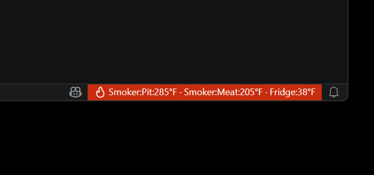
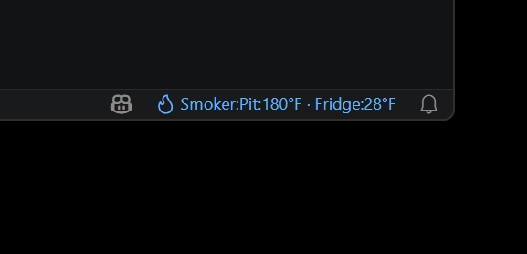
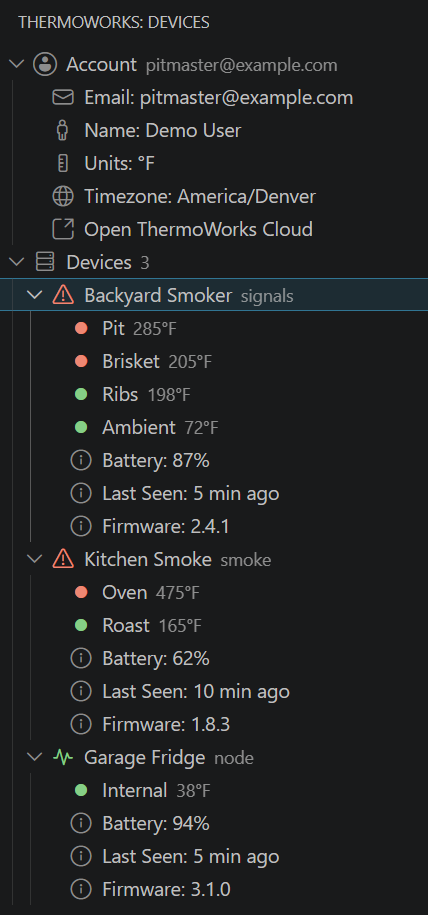

# ThermoWorks

[](https://github.com/jongio/thermoworks/actions/workflows/ci.yml)
[](https://www.npmjs.com/package/thermoworks)
[](https://www.npmjs.com/package/thermoworks-sdk)
[](https://marketplace.visualstudio.com/items?itemName=jongio.thermoworks)
[](https://opensource.org/licenses/MIT)
[](https://nodejs.org)

> **Disclaimer:** This project is not affiliated with, endorsed by, or connected to [ThermoWorks](https://www.thermoworks.com/) in any way. It is an unofficial, community-built tool created by ThermoWorks customers for personal use.

See live temperatures from your ThermoWorks Cloud devices in the terminal, GitHub Copilot CLI statusline, VS Code status bar, or a full device panel — with color-coded alarm alerts.


## Quick Start

```bash
# Sign in to ThermoWorks Cloud
npx thermoworks auth login

# Run the Copilot statusline setup wizard
npx thermoworks copilot setup
```

Done — your selected devices can now appear in the GitHub Copilot CLI statusline and VS Code status bar. For command details, see the [CLI reference](docs/cli-reference.md).

## Features

### 🚨 Temperature Alerts

Instant visual alarms when temperatures cross thresholds — red for too high, blue for too low. VS Code blinks the status bar; the CLI uses ANSI color codes.






### 📋 VS Code Device Panel

Full sidebar tree view with all devices, live channel readings, battery levels, firmware info, and alarm badges — right in your editor.



Install the **ThermoWorks** extension from the [VS Code Marketplace](https://marketplace.visualstudio.com/items?itemName=jongio.thermoworks). The extension shares credentials and device configuration with the CLI — sign in once and both tools see your devices.

See the [extension README](packages/vscode/README.md) for details.

### 📟 Copilot CLI Statusline

Live temperatures appear in the GitHub Copilot CLI footer while you code. Run `npx thermoworks copilot setup` to pick devices and channels with an interactive wizard.

### 💻 VS Code Status Bar

Temperatures in the VS Code footer at a glance with configurable auto-refresh (default 30s).

### 📊 Per-Channel Selection

Pick averages or individual channels for multi-probe devices like the Signals 4-channel or Smoke 2-channel.

### 🛠️ SDK for Custom Integrations

Build your own dashboards, alerts, or automations with the [`thermoworks-sdk`](https://www.npmjs.com/package/thermoworks-sdk) Node.js package — full access to devices, channels, events, archives, calibration data, and more.

### 🔐 Secure Credential Storage

Credentials stored in the OS keychain (macOS Keychain, Windows Credential Vault, libsecret). Sign in once — CLI and VS Code share access. Environment variables (`THERMOWORKS_EMAIL` / `THERMOWORKS_PASSWORD`) supported for headless environments.

### 🎬 Demo Mode

Test alarm styling and take screenshots without real credentials:

```bash
# CLI one-shot demo
npx thermoworks demo high    # red text
npx thermoworks demo low     # blue text
npx thermoworks demo normal  # no color

# Auto-cycling statusline demo
npx thermoworks copilot setup --demo
```

In VS Code: Command Palette → **ThermoWorks: Demo (Simulate Alarm)** — populates the full panel and status bar with fake devices.

## Packages

| Package | Description |
|---------|-------------|
| [`thermoworks`](https://www.npmjs.com/package/thermoworks) | CLI for authentication, Copilot statusline setup, device listing, and demo mode |
| [`thermoworks-sdk`](https://www.npmjs.com/package/thermoworks-sdk) | Node.js SDK for programmatic access to ThermoWorks Cloud |
| [ThermoWorks for VS Code](https://marketplace.visualstudio.com/items?itemName=jongio.thermoworks) | Extension with status bar, device panel, alarm indicators, and demo mode |

## Documentation

- [CLI Reference](docs/cli-reference.md) — all commands, flags, and options
- [API Reference](docs/api-reference.md) — ThermoWorks Cloud Firestore REST API

## Development

This repository uses `pnpm` workspaces.

```bash
# Install dependencies
pnpm install

# Lint the monorepo
pnpm lint

# Run tests
pnpm test

# Build all packages
pnpm build

# Type-check all packages
pnpm typecheck
```

## License

MIT
