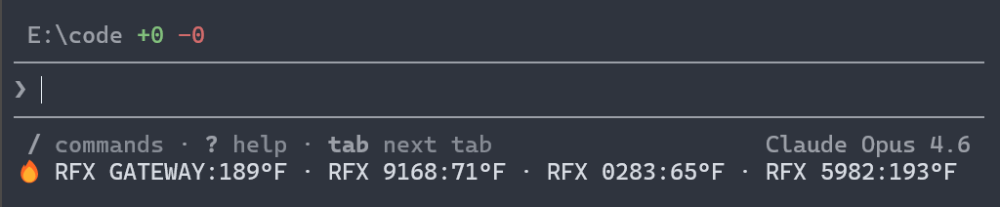
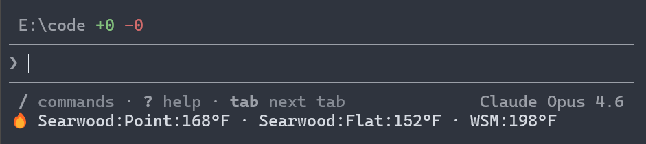

# ThermoWorks

> **Disclaimer:** This project is not affiliated with, endorsed by, or connected to [ThermoWorks](https://www.thermoworks.com/) in any way. It is an unofficial, community-built tool created by ThermoWorks customers for personal use.

See live temperatures from your ThermoWorks Cloud devices in the terminal or GitHub Copilot CLI statusline.





## Quick Start

```bash
# Sign in to ThermoWorks Cloud
npx thermoworks auth login

# Run the Copilot statusline setup wizard
npx thermoworks copilot setup
```

Done — your selected devices can now appear in the GitHub Copilot CLI statusline. For command details, see the [CLI reference](docs/cli-reference.md).

## Features

- Log in with your ThermoWorks Cloud account and store credentials in your OS keychain
- Configure a GitHub Copilot CLI statusline that shows live device or channel temperatures
- Choose device averages or specific channels for multi-channel probes
- List devices connected to your ThermoWorks Cloud account
- Use the SDK for scripts, automations, and custom integrations

## Packages

| Package | Description |
|---------|-------------|
| [`thermoworks`](packages/cli) | End-user CLI for authentication, Copilot statusline setup, and device listing |
| [`thermoworks-sdk`](packages/sdk) | Node.js SDK for programmatic access to ThermoWorks Cloud |

## Development

This repository uses `pnpm` workspaces.

```bash
# Install dependencies
pnpm install

# Lint the monorepo
pnpm lint

# Run tests
pnpm test

# Build all packages
pnpm build

# Type-check all packages
pnpm typecheck
```

## License

MIT
