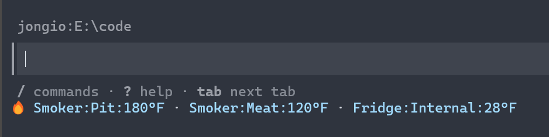
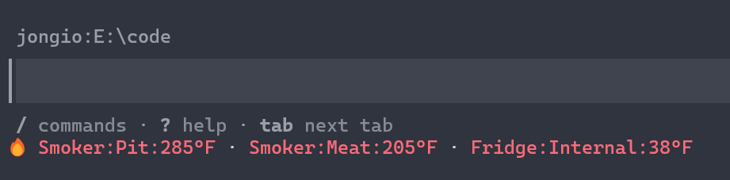

# CLI Reference

## `thermoworks auth login`

Authenticate with ThermoWorks Cloud. Prompts for your email and password, verifies the credentials against the cloud API, then saves them to your OS keychain.

**Usage**

```bash
npx thermoworks auth login
```

**Options**

None.

**Examples**

```bash
npx thermoworks auth login
```

**Notes**

- Prints `ThermoWorks Cloud Login` before prompting.
- Exits with an error if either prompt is left blank.
- Stores credentials in the system keychain after successful verification.

## `thermoworks auth logout`

Remove saved ThermoWorks credentials from the OS keychain.

**Usage**

```bash
npx thermoworks auth logout
```

**Options**

None.

**Examples**

```bash
npx thermoworks auth logout
```

**Notes**

- Prints `Credentials removed from system keychain.` when credentials were deleted.
- Prints `No credentials found in system keychain.` when nothing was stored.

## `thermoworks auth status`

Show the current authentication state.

**Usage**

```bash
npx thermoworks auth status
```

**Options**

None.

**Examples**

```bash
npx thermoworks auth status
```

**Notes**

- When both `THERMOWORKS_EMAIL` and `THERMOWORKS_PASSWORD` are set, runtime commands resolve credentials from those environment variables before checking the keychain.
- Possible output includes:
  - `Logged in as you@example.com`
  - `Stored email: you@example.com (password missing)`
  - `Not logged in. Run: thermoworks auth login`

## `thermoworks copilot setup [--dev] [--demo]`

Interactive wizard to configure the GitHub Copilot CLI statusline.

**Usage**

```bash
npx thermoworks copilot setup
npx thermoworks copilot setup --dev
npx thermoworks copilot setup --demo
```

**Options**

- `--dev` - Use a local `node <repo>\dist\index.js copilot status` command instead of the default production command selection.
- `--demo` - Skip credentials and device selection entirely; configure the statusline to show fake data that cycles through alarm states (normal → high → low) on each Copilot refresh. Useful for testing and screenshots.

**Examples**

```bash
npx thermoworks copilot setup
```

```bash
npx thermoworks copilot setup --dev
```

**Notes**

- Requires valid credentials from environment variables or the OS keychain.
- Fetches all devices and channel readings before prompting.
- Device selection uses a checkbox list with current average temperatures.
- Multi-channel devices show a second checkbox list with `Average (...)` plus each channel label and live reading.
- Saves CLI config to `~/.thermoworks/config.json`.
- API responses are cached for 30 seconds to avoid excessive requests.
- The Copilot CLI statusline updates each time Copilot re-renders (on new prompts, responses, and state changes). Temperatures are not polled on a background timer.
- Optionally writes a managed `statusLine` entry to `~/.copilot/settings.json`.
- If `~/.copilot/settings.json` contains invalid JSON, setup stops and asks you to fix it manually.
- If an existing statusline is present and it was not created by `thermoworks`, the command prompts before overwriting it.

## `thermoworks copilot status [--demo]`

Output the configured temperature reading string for the Copilot statusline.

**Usage**

```bash
npx thermoworks copilot status
npx thermoworks copilot status --demo
```

**Options**

- `--demo` - Output fake demo data instead of real readings. Cycles through alarm states (normal → high → low) on each invocation. No credentials required.

**Examples**

```bash
npx thermoworks copilot status
```

**Notes**

- Reads `~/.thermoworks/config.json` and silently exits when no devices are configured.
- Uses a cache file in `~/.thermoworks/.cache/readings.json`. API responses are cached for 30 seconds to avoid excessive requests.
- The statusline updates each time Copilot CLI re-renders (on prompts, responses, and state changes), not on a background timer.
- Output format is:

```text
🔥 Name:temp · Name:temp
```

- When a channel's alarm is active, the reading is styled with ANSI escape codes:
  - **High alarm** — bright red (`\x1b[91m`)
  - **Low alarm** — bright blue (`\x1b[94m`)

  

  
- For entries configured as `"avg"`, the CLI averages temperature channels and excludes humidity channels.
- For channel-specific entries, labels come from the ThermoWorks channel label or fall back to `<device label> Ch<channel>`.
- On API failures it stays silent so the Copilot statusline does not spam errors.

## `thermoworks copilot remove`

Remove the `thermoworks`-managed statusline configuration from GitHub Copilot CLI settings.

**Usage**

```bash
npx thermoworks copilot remove
```

**Options**

None.

**Examples**

```bash
npx thermoworks copilot remove
```

**Notes**

- Only removes `statusLine` entries tagged with `_managedBy: "thermoworks"` or `"thermoworks-demo"`.
- Prints `Statusline is not managed by thermoworks. Not removing.` when the existing statusline belongs to something else.
- Prints `No settings file found. Nothing to remove.` when `~/.copilot/settings.json` does not exist.

## `thermoworks devices`

List all connected devices visible in your ThermoWorks Cloud account.

**Usage**

```bash
npx thermoworks devices [--type T] [--status S] [--label L] [--serial SN] [--active-within N]
```

**Options**

- `--type <T>` - Filter by device type (e.g. `node`, `smoke`, `signals`). Comma-separated for match-any.
- `--status <S>` - Filter by status (e.g. `online`, `offline`). Comma-separated for match-any.
- `--label <L>` - Filter by exact device label. Comma-separated for match-any.
- `--serial <SN>` - Filter by serial number. Comma-separated for match-any.
- `--active-within <N>` - Only include devices seen within N minutes.
- `--no-channels` - Hide channel readings.
- `--json` - Output as JSON.

**Examples**

```bash
npx thermoworks devices
npx thermoworks devices --status online
npx thermoworks devices --type node,smoke
npx thermoworks devices --active-within 30 --json
```

**Notes**

- Requires valid credentials from environment variables or the OS keychain.
- Prints `No devices found.` when the account has no devices, or `No devices match the filter.` when a filter excludes everything.
- Otherwise prints one line per device with the label or serial number, and includes any available type, status, battery percentage, and `last seen` age.
- Filters combine (all must match). Type, status, label, and serial values are matched exactly.


## `thermoworks temp <SERIAL>`

Print a single temperature value to stdout for shell scripts and automation. Without
`--channel` it prints the device average temperature; with `--channel N` it prints that
channel's current reading.

**Usage**

```bash
npx thermoworks temp <SERIAL> [--channel <1-9>] [--json]
```

**Arguments**

- `SERIAL` - (Required) Device serial number.

**Options**

- `--channel <1-9>` - Read a specific channel instead of the device average.
- `--json` - Output `{ serial, channel, value, units }` as JSON. `channel` is `null` when averaging.

**Examples**

```bash
npx thermoworks temp M100009168
# 203.5

npx thermoworks temp M100009168 --channel 2
# 165

npx thermoworks temp M100009168 --json
# {"serial":"M100009168","channel":null,"value":203.5,"units":"F"}

# use it in a shell conditional
if (( $(npx thermoworks temp M100009168) > 200 )); then echo "pull it"; fi
```

**Notes**

- Requires valid credentials from environment variables or the OS keychain.
- Human output is a bare number so it can be piped or captured directly.
- The average (no `--channel`) excludes humidity channels and channels with no reading.
- Exits non-zero with a message on stderr when no reading is available.

## `thermoworks demo <high|low|normal>`

Output demo temperature data with alarm styling. No credentials or device configuration required.

**Usage**

```bash
npx thermoworks demo high
npx thermoworks demo low
npx thermoworks demo normal
```

**Options**

None. The mode argument is required.

**Examples**

```bash
npx thermoworks demo high
# 🔥 Smoker:Pit:285°F · Smoker:Meat:205°F · Fridge:Internal:38°F  (red)

npx thermoworks demo low
# 🔥 Smoker:Pit:180°F · Smoker:Meat:120°F · Fridge:Internal:28°F  (blue)

npx thermoworks demo normal
# 🔥 Smoker:Pit:225°F · Smoker:Meat:165°F · Fridge:Internal:38°F  (no color)
```

**Notes**

- Useful for testing alarm styling, taking screenshots, or verifying terminal ANSI support.
- High mode uses bright red ANSI color; low mode uses bright blue.
- Normal mode outputs plain text with no ANSI escape codes.

## `thermoworks mcp start`

Start the MCP (Model Context Protocol) server over stdio. This exposes ThermoWorks device data to AI assistants like GitHub Copilot, Claude, and ChatGPT.

**Usage**

```bash
npx thermoworks mcp start
```

**Options**

None.

**Examples**

```bash
npx thermoworks mcp start
```

**Notes**

- The server runs over stdio — it is designed to be launched by an MCP client, not used interactively.
- Credentials are resolved from environment variables (`THERMOWORKS_EMAIL` + `THERMOWORKS_PASSWORD`) first, then from the OS keychain.
- If no credentials are available, the server exits with an error.
- Exposes 16 tools: `get_devices`, `get_device`, `get_device_channels`, `get_average_temperature`, `get_live_cook_snapshot`, `get_events`, `get_archives`, `get_archive_detail`, `get_temperature_guide`, `set_alarm`, `get_fan_state`, `set_fan_target`, `set_fan_enabled`, `start_session`, `end_session`, `get_firmware_status`.
- Errors from the ThermoWorks SDK are sanitized before being returned to the client.
- Add to your MCP client config (e.g., `~/.copilot/settings.json`):

```json
{
  "mcpServers": {
    "thermoworks": {
      "command": "thermoworks",
      "args": ["mcp", "start"]
    }
  }
}
```

## `thermoworks alarm set`

Set alarm thresholds on a device channel. At least one of `--high` or `--low` must be specified.

**Usage**

```bash
npx thermoworks alarm set <SERIAL> --channel <1-9> --high <temp> --low <temp>
```

**Options**

- `--channel <1-9>` - (Required) Channel number to set the alarm on.
- `--high <temp>` - High alarm threshold temperature.
- `--low <temp>` - Low alarm threshold temperature.
- `--json` - Output the updated alarm state as JSON.

**Examples**

```bash
npx thermoworks alarm set ABC123 --channel 1 --high 275 --low 200
# Alarm set on ABC123:
#   Channel 1  high=275°F  low=200°F

npx thermoworks alarm set ABC123 --channel 2 --high 165
# Alarm set on ABC123:
#   Channel 2  high=165°F
```

**Notes**

- Requires valid credentials from environment variables or the OS keychain.
- At least one of `--high` or `--low` must be provided; you can set both in a single call.
- Channel must be an integer from 1 to 9.
- After setting the alarm, the command reads back and displays the confirmed alarm state.

## `thermoworks alarm clear`

Clear alarm thresholds on a device channel, disabling both high and low alarms.

**Usage**

```bash
npx thermoworks alarm clear <SERIAL> --channel <1-9>
```

**Options**

- `--channel <1-9>` - (Required) Channel number to clear alarms on.
- `--json` - Output the updated alarm state as JSON.

**Examples**

```bash
npx thermoworks alarm clear ABC123 --channel 1
# Alarms cleared on ABC123:
#   Channel 1  alarms disabled
```

**Notes**

- Requires valid credentials from environment variables or the OS keychain.
- Disables both high and low alarms on the specified channel.
- After clearing, the command reads back and displays the confirmed alarm state.

## `thermoworks alarm list`

List configured (armed) alarm thresholds across your devices. Read-only, so it never
changes any settings. Useful for auditing what alarms are set before starting a cook.

**Usage**

```bash
npx thermoworks alarm list [SERIAL]
```

**Arguments**

- `SERIAL` - (Optional) Limit the audit to one device. When omitted, every device on the
  account is scanned.

**Options**

- `--json` - Output the armed alarms as a JSON array.

**Examples**

```bash
npx thermoworks alarm list
# Signals (ABC123)
#   Brisket: high=203°F
#   Ambient: high=275°F  low=225°F
# Smoke X4 (DEF456)
#   Probe 1: low=34°F

npx thermoworks alarm list ABC123

npx thermoworks alarm list --json
```

**Output**

- Only channels with a high or low alarm armed are listed. Devices with no armed alarms
  are skipped.
- Human output groups armed channels under a bold device header (`label (serial)`), one
  channel per line with `high=` and/or `low=` thresholds.
- With `--json`, prints an array of
  `{ serial, deviceLabel, channel, channelLabel, alarmHigh, alarmLow }`. Disarmed sides
  are `null`.
- When nothing is armed, prints `No armed alarms on any device.` (or `No armed alarms on
  <SERIAL>.` when scoped) in human mode, or `[]` with `--json`.

**Notes**

- Requires valid credentials from environment variables or the OS keychain.

## `thermoworks archives`

List or inspect archived cooking sessions for a device.

**Usage**

```bash
npx thermoworks archives <SERIAL> [--id ID] [--limit N]
```

**Options**

- `<SERIAL>` - (Required) Device serial number.
- `--id ID` - Show detailed view of a specific archive by ID.
- `--limit N` - Maximum number of archives to list.
- `--json` - Output as JSON.

**Examples**

```bash
npx thermoworks archives ABC123
# Found 3 archives:
#
#   Weekend Brisket
#     Start: 6/1/2026, 8:00:00 AM  Duration: 12h 30m  Readings: 750
#     ID: arch-001
#
#   Pork Shoulder
#     Start: 5/28/2026, 7:15:00 AM  Duration: 9h 45m  Readings: 585
#     ID: arch-002

npx thermoworks archives ABC123 --id arch-001
# Archive: Weekend Brisket
#   ID:       arch-001
#   Start:    6/1/2026, 8:00:00 AM
#   End:      6/1/2026, 8:30:00 PM
#   Duration: 12h 30m
#   Readings: 750
#
#   Channels:
#     Pit: min=215°F max=285°F last=250°F
#     Meat: min=38°F max=205°F last=205°F

npx thermoworks archives ABC123 --limit 5 --json
```

**Notes**

- Requires valid credentials from environment variables or the OS keychain.
- Without `--id`: lists archives showing label, start time, duration, and reading count.
- With `--id`: shows detailed view including per-channel min/max/last values.
- Prints `No archives found.` when the device has no archived sessions.

## `thermoworks stats`

Summarize a device's archived cook sessions into aggregate metrics.

**Usage**

```bash
npx thermoworks stats <SERIAL> [--limit N] [--json]
```

**Options**

- `<SERIAL>` - (Required) Device serial number.
- `--limit N` - Summarize only the N most recent archives.
- `--json` - Output as JSON. Durations are reported in seconds and dates as ISO strings.

**Examples**

```bash
npx thermoworks stats ABC123
# Cook statistics for ABC123
#
#   Archived sessions:   3
#   Sessions with times: 2
#   Total cook time:     22h 15m
#   Average cook time:   11h 7m
#   Median cook time:    11h 7m
#   Total readings:      1335
#   Longest cook:        12h 30m  (Weekend Brisket)
#   Shortest cook:       9h 45m  (Pork Shoulder)
#   First session start: 5/28/2026, 7:15:00 AM
#   Last session end:    6/1/2026, 8:30:00 PM

npx thermoworks stats ABC123 --limit 50 --json
```

**Notes**

- Requires valid credentials from environment variables or the OS keychain.
- Archives without a recorded start and end are counted in the session total but left out of the duration figures.
- The median averages the two middle values when the duration count is even.
- Prints `No archives found.` when the device has no archived sessions.

## `thermoworks calibration`

Show NIST-traceable calibration data for a device, including low-point adjustments and high-point reference measurements.

**Usage**

```bash
npx thermoworks calibration <SERIAL> [--interval-months N]
```

**Options**

- `<SERIAL>` - (Required) Device serial number.
- `--interval-months N` - Months between recommended recalibrations, used for the due-date check (default: 12).
- `--json` - Output as JSON. Each record gains a `recalibration` block with `status` (`current`, `due-soon`, `overdue`, or `unknown`), `calibratedAt`, `dueAt`, and `daysRemaining`.

**Examples**

```bash
npx thermoworks calibration ABC123
# Calibration: CAL-2026-001
#   Date:        January 15, 2026
#   Next due:    January 15, 2027
#   Status:      current
#   Technician:  J. Smith
#   Reference:   NIST-traceable reference thermometer
#   Accuracy:    ±0.05°F
#   Result:      PASS
#
#   Low-Point Adjustments
#   Ch  Value       Reference   Deviation   Trim      Result
#   ----------------------------------------------------------
#   1   32.1°F      32.0°F      +0.1°F      -0.1      PASS
#   2   32.0°F      32.0°F      +0.0°F      -         PASS
```

**Notes**

- Requires valid credentials from environment variables or the OS keychain.
- Displays calibration records with date, technician, manager, reference instrument, and stated accuracy.
- Measurement points are displayed in a table showing channel, measured value, reference value, deviation, trim adjustment, and pass/fail result.
- Results are color-coded: green for PASS, red for FAIL.
- The `Status` line flags recalibration timing: green `current`, yellow `due soon` within 30 days of the due date, red `overdue` past it, and `unknown` when the device reports no calibration date.
- Prints `No calibration records found for <serial>.` when no records exist.

## `thermoworks events`

Show device event history including alarms, status changes, and connectivity events.

**Usage**

```bash
npx thermoworks events [--device SERIAL] [--type TYPE] [--limit N]
```

**Options**

- `--device SERIAL` - Filter events to a specific device by serial number.
- `--type TYPE` - Filter by event type (e.g., `alarm`, `status`, `connection`).
- `--limit N` - Maximum number of events to return.
- `--json` - Output as JSON.

**Examples**

```bash
npx thermoworks events
# Found 5 events:
#
#   [CRITICAL] alarm  ABC123  2 minutes ago  250 → 285
#   [WARNING] alarm  ABC123  15 minutes ago  200 → 180
#   [INFO] connection  DEF456  1 hour ago

npx thermoworks events --device ABC123 --limit 10

npx thermoworks events --type alarm --json
```

**Notes**

- Requires valid credentials from environment variables or the OS keychain.
- Events are displayed with a severity badge: `[CRITICAL]` (red), `[WARNING]` (yellow), or `[INFO]`.
- Each event shows: severity, event type, device serial, relative time, and value change (if applicable).
- Prints `No events found.` when no events match the filters.

## `thermoworks export`

Export archive readings to CSV or JSON format. Outputs to stdout by default, or writes to a file with `--output`.

**Usage**

```bash
npx thermoworks export <SERIAL> [--archive ID] [--format csv|json] [--output PATH]
```

**Options**

- `<SERIAL>` - (Required) Device serial number.
- `--archive ID` - Export a specific archive by ID. Defaults to the latest archive.
- `--format csv|json` - Output format. Defaults to `json`.
- `--output PATH` - Write to a file instead of stdout.

**Examples**

```bash
npx thermoworks export ABC123
# [
#   { "timestamp": "2026-06-01T08:00:00.000Z", "channel": "Pit", "value": 225, "units": "F" },
#   { "timestamp": "2026-06-01T08:00:00.000Z", "channel": "Meat", "value": 38, "units": "F" },
#   ...
# ]

npx thermoworks export ABC123 --format csv
# timestamp,channel,value,units
# 2026-06-01T08:00:00.000Z,Pit,225,F
# 2026-06-01T08:00:00.000Z,Meat,38,F

npx thermoworks export ABC123 --archive arch-001 --format csv --output brisket.csv
# Exported 750 readings to brisket.csv
```

**Notes**

- Requires valid credentials from environment variables or the OS keychain.
- Without `--archive`, exports the most recent archive for the device.
- Readings are flattened into rows with timestamp, channel label, value, and units.
- Rows are sorted by timestamp ascending.
- CSV fields containing commas, quotes, or newlines are properly escaped.
- When writing to a file, a summary line is printed to stderr (not stdout) so piping works correctly.
- Exits with an error if no archives are found for the device.

## `thermoworks backup [SERIAL]`

Bulk-export archived sessions to a directory, writing one file per archive. Reuses the same reading-flattening as `export`, so each file has the same shape.

**Usage**

```bash
npx thermoworks backup [SERIAL] [--output DIR] [--format csv|json] [--limit N]
```

**Arguments**

- `SERIAL` - (Optional) Limit the backup to one device. When omitted, every device on the account is backed up.

**Options**

- `--output DIR` or `-o DIR` - Directory to write files into. Created if it does not exist. Defaults to `thermoworks-backup`.
- `--format csv|json` - Output format for each file. Defaults to `json`.
- `--limit N` - Maximum number of archives to export per device. Defaults to 20.
- `--json` - Print a JSON manifest of what was backed up instead of the per-file listing.

**Examples**

```bash
npx thermoworks backup
# thermoworks-backup/ABC123-arch-001.json  (750 readings)
# thermoworks-backup/ABC123-arch-002.json  (612 readings)
# Backed up 2 archive(s), 1362 readings total, to thermoworks-backup

npx thermoworks backup ABC123 --output ./cooks --format csv --limit 50

npx thermoworks backup --json
# [{"serial":"ABC123","archiveId":"arch-001","label":"Brisket","file":"thermoworks-backup/ABC123-arch-001.json","readings":750}]
```

**Notes**

- Requires valid credentials from environment variables or the OS keychain.
- Files are named `<serial>-<archiveId>.<ext>` with unsafe characters replaced.
- Archive list entries usually include their readings; when one does not, the full archive is fetched before writing.
- The per-file listing is written to stdout and the final tally to stderr so piping works correctly.
- With `--json`, the manifest is the only stdout output.

## `thermoworks history`

Export historical time-series readings from BigQuery for post-cook analysis or data pipelines. Unlike `export` (which reads from a single archive session), `history` retrieves the full BigQuery time-series for a device.

**Usage**

```bash
npx thermoworks history <SERIAL> [--limit N] [--format table|csv|json] [--output PATH]
```

**Options**

- `<SERIAL>` - (Required) Device serial number.
- `--limit N` - Show the N most recent readings.
- `--format table|csv|json` - Output format. Defaults to `table`. When the global `--json` flag is active and no explicit `--format` is given, defaults to `json`.
- `--output PATH` - Write to a file instead of stdout.

**Examples**

```bash
npx thermoworks history ABC123
# Timestamp                  Value  Units  Trend
# 2026-06-01T08:00:00.000Z  225    F      ▁
# 2026-06-01T08:01:00.000Z  226    F      ▁█

npx thermoworks history ABC123 --limit 100 --format csv
# timestamp,value,units
# 2026-06-01T08:00:00.000Z,225,F
# 2026-06-01T08:01:00.000Z,226,F

npx thermoworks history ABC123 --format json
# {
#   "deviceId": "ABC123",
#   "readings": [
#     {
#       "timestamp": "2026-06-01T08:00:00.000Z",
#       "value": 225,
#       "units": "F"
#     }
#   ]
# }

npx thermoworks history ABC123 --limit 50 --format csv --output brisket.csv
# Wrote 50 readings to brisket.csv.
```

**Notes**

- Requires valid credentials from environment variables or the OS keychain.
- Readings are a flat list of `{ timestamp, value, units }` from the BigQuery time-series API.
- `--limit N` takes the N most recent readings from the end of the chronological list.
- Table output includes a compact sparkline per row so trend shape is visible in the terminal.
- When the output format is `table` and no readings exist, prints `No history available for <SERIAL>.`
- When writing to a file, a summary line is printed to stderr (not stdout) so piping works correctly.

## `thermoworks graph`

Draw a temperature chart directly in the terminal. The `history` table and the one-line sparklines are useful, but neither shows the shape of a whole cook at a glance. `graph` renders a multi-row line chart from a device's recent history or a specific archive.

**Usage**

```bash
npx thermoworks graph <SERIAL> [--archive ID] [--channel N] [--width N] [--height N]
```

**Options**

- `<SERIAL>` - (Required) Device serial number.
- `--archive ID` - Chart a saved archive instead of recent history.
- `--channel N` - Which archive channel to chart. Defaults to the first channel that has readings.
- `--width N` - Chart width in columns. Defaults to 60, minimum 10.
- `--height N` - Chart height in rows. Defaults to 12, minimum 3.

**Examples**

```bash
npx thermoworks graph ABC123
# ABC123 - recent history (°F)
# 2026-06-01, 8:00 AM  to  2026-06-01, 2:00 PM
#
# 225 ┤                                     *********
# ...
#  70 ┤*****
#     └────────────────────────────────────────────

npx thermoworks graph ABC123 --archive a1b2c3 --channel 1 --width 80 --height 16
```

**Notes**

- Requires valid credentials from environment variables or the OS keychain.
- The Y axis labels are interpolated between the series minimum and maximum. The X axis spans the reading time range, shown above the chart.
- Long series are down-sampled to the chart width by averaging contiguous buckets.
- Empty, single-reading, and flat series are handled without dividing by zero.
- Prints `No readings to chart for <SERIAL>.` when there is nothing to plot.

## `thermoworks firmware`

Show firmware versions for all devices and indicate whether updates are available.

**Usage**

```bash
npx thermoworks firmware [--device SERIAL]
```

**Options**

- `--device SERIAL` - Check firmware for a specific device only.
- `--json` - Output as JSON.

**Examples**

```bash
npx thermoworks firmware
# Smoker (Signals)    firmware: 2.1.0  latest: 2.2.0  ⚠️  UPDATE AVAILABLE
# Fridge (TempLog)    firmware: 1.5.3  latest: 1.5.3  ✓  UP TO DATE

npx thermoworks firmware --device ABC123 --json
```

**Notes**

- Requires valid credentials from environment variables or the OS keychain.
- Only checks devices that report both a device type and firmware version.
- Fetches the latest available firmware per device type in parallel.
- Update available status is shown in yellow; up-to-date status in green.
- Prints `No devices with firmware information found.` when no devices have firmware data.

## `thermoworks data-usage`

Show total account data storage usage.

**Usage**

```bash
npx thermoworks data-usage [--by-device]
```

**Options**

- `--by-device` - Show per-device breakdown (device id + formatted size) sorted by size descending.
- `--json` - Output as JSON. Returns `DataUsage` for total view, `DeviceDataUsage[]` for `--by-device`.

**Examples**

```bash
npx thermoworks data-usage
# Account data usage: 12.4 MB

npx thermoworks data-usage --by-device
# DEV-C  48.8 KB
# DEV-B   9.8 KB
# DEV-A   1.0 KB

npx thermoworks data-usage --json
npx thermoworks data-usage --by-device --json
```

**Notes**

- Requires valid credentials from environment variables or the OS keychain.
- Prints `No device data usage.` when no devices have data (with `--by-device`).
- Zero bytes total is displayed as `0 B`.

## `thermoworks notifications`

Show account notification settings, and optionally toggle an individual alert channel.

**Usage**

```bash
npx thermoworks notifications [--enable FIELD | --disable FIELD]
```

**Options**

- `--enable FIELD` - Turn a setting on, then show the refreshed settings.
- `--disable FIELD` - Turn a setting off, then show the refreshed settings.
- `--json` - Output the `NotificationSettings` object as JSON.

`FIELD` is one of:

- `all` - Master toggle (`enabled`).
- `continuous` - Continuous alerts (`continuousAlerts`).
- `email` - Email alerts (`emailNotification`).
- `sms` - SMS alerts (`smsNotification`).
- `device` - Device/app alerts (`deviceNotification`).

**Examples**

```bash
npx thermoworks notifications
# Notification settings
#   Notifications enabled  on
#   Continuous alerts      off
#   Email alerts           on
#   SMS alerts             off
#   Device (app) alerts    on

npx thermoworks notifications --enable sms
npx thermoworks notifications --disable email
npx thermoworks notifications --json
```

**Notes**

- Requires valid credentials from environment variables or the OS keychain.
- Only one `--enable` or `--disable` may be given per invocation.
- The current settings are always printed after any change is applied.

## `thermoworks account`

Show account metadata and the current billing plan.

**Usage**

```bash
npx thermoworks account
```

**Options**

- `--json` - Output as JSON: `{ "account": Account, "billingPlan": BillingPlan | null }`.

**Examples**

```bash
npx thermoworks account
# Account
#   Name:       Jane's Kitchen
#   Account ID: acct-abc123
#   Type:       standard
#   Created:    March 15, 2024
#
# Billing plan
#   Plan:       Cloud Basic
#   Price:      Free
#   Devices:    3

npx thermoworks account --json
```

**Notes**

- Requires valid credentials from environment variables or the OS keychain.
- Optional account fields (name, type, created date) display as `N/A` when not set.
- Prints `No billing plan on file.` when the account has no billing plan.

## `thermoworks fan <SERIAL>`

Show the current fan/blower controller state for a Signals device.

**Usage**

```bash
npx thermoworks fan <SERIAL>
```

**Options**

- `<SERIAL>` - (Required) Device serial number.
- `--json` - Output as JSON (the raw `FanSettings` object, or `null` if no fan).

**Examples**

```bash
npx thermoworks fan ABC123
# Fan controller for ABC123:
#   Connected:   yes
#   Connection:  enabled
#   Target temp: 225
#   Channel:     1
#   State:       1

npx thermoworks fan ABC123 --json
```

**Notes**

- Requires valid credentials from environment variables or the OS keychain.
- Prints `No fan controller found for device <SERIAL>.` when the device has no fan.
- With `--json`, outputs the `FanSettings` object or `null`.

## `thermoworks fan set <SERIAL> --target <temp>`

Set the fan controller target temperature.

**Usage**

```bash
npx thermoworks fan set <SERIAL> --target <temp>
```

**Options**

- `<SERIAL>` - (Required) Device serial number.
- `--target <temp>` - (Required) Target temperature. Must be a finite number.
- `--json` - Output as JSON (the `ActionResult` object).

**Examples**

```bash
npx thermoworks fan set ABC123 --target 225
# Fan target temperature set to 225 for ABC123.

npx thermoworks fan set ABC123 --target 225 --json
```

**Notes**

- Requires valid credentials from environment variables or the OS keychain.
- Exits with an error if `--target` is missing or the value is not a finite number.
- Exits with an error if the operation fails (e.g., device offline).

## `thermoworks fan enable <SERIAL>`

Enable the fan controller connection on a device.

**Usage**

```bash
npx thermoworks fan enable <SERIAL>
```

**Options**

- `<SERIAL>` - (Required) Device serial number.
- `--json` - Output as JSON (the `ActionResult` object).

**Examples**

```bash
npx thermoworks fan enable ABC123
# Fan controller enabled for ABC123.
```

**Notes**

- Requires valid credentials from environment variables or the OS keychain.
- Exits with an error if the operation fails.

## `thermoworks fan disable <SERIAL>`

Disable the fan controller connection on a device.

**Usage**

```bash
npx thermoworks fan disable <SERIAL>
```

**Options**

- `<SERIAL>` - (Required) Device serial number.
- `--json` - Output as JSON (the `ActionResult` object).

**Examples**

```bash
npx thermoworks fan disable ABC123
# Fan controller disabled for ABC123.
```

**Notes**

- Requires valid credentials from environment variables or the OS keychain.
- Exits with an error if the operation fails.

## `thermoworks search <query>`

Full-text search across devices, accounts, or users.

**Usage**

```bash
npx thermoworks search <query> [--collection device|accounts|users] [--limit N]
```

**Options**

- `<query>` - (Required) Search query. Multiple words are joined automatically.
- `--collection <value>` - Search collection: `device`, `accounts`, or `users` (default: `device`).
- `--limit <N>` - Max results per page (default: 20, max: 100). Must be an integer from 1 to 100.
- `--json` - Output the full `SearchResult` object as JSON.

**Examples**

```bash
npx thermoworks search "brisket"
#   AB1234  Pit Boss Smoker  (score: 0.95)
#   CD5678  Brisket Probe    (score: 0.82)

npx thermoworks search pit boss --collection device --limit 5

npx thermoworks search "chef" --collection users --json
```

**Notes**

- Requires valid credentials from environment variables or the OS keychain.
- Searches the `device` collection by default.
- Displays one line per hit: id, a display label (from `label`, `name`, `serial`, or `email`), and the relevance score.
- Prints `No results found for "<query>".` when there are no hits.
- Exits with an error if `--collection` is not one of `device`, `accounts`, `users`.
- Exits with an error if `--limit` is not a valid integer between 1 and 100.

## `thermoworks guide`

Show the ThermoWorks temperature guide with safe cooking temperatures, organized by category.

**Usage**

```bash
npx thermoworks guide [category]
```

**Options**

- `[category]` - (Optional) Filter categories by name (case-insensitive substring match).
- `--json` - Output as JSON.

**Examples**

```bash
npx thermoworks guide
# 🥩  Beef & Lamb
#    ⚠ Pull: Remove 5°F before target
# 🐔  Poultry
#    ⚠ All poultry must reach 165°F internal
# 🐖  Pork
# 🐟  Seafood

npx thermoworks guide beef
# 🥩  Beef & Lamb
#    ⚠ Pull: Remove 5°F before target

npx thermoworks guide --json
```

**Notes**

- Requires valid credentials from environment variables or the OS keychain.
- Categories include icons, labels, and optional warnings (pull temperature offsets, safety notices).
- The category filter is a case-insensitive substring match against category labels.
- Prints `No categories matching "<filter>".` when the filter has no matches.
- Prints `No temperature guide categories found.` when the guide data is empty.

## `thermoworks doneness`

Show recommended internal pull temperatures for common cuts. This reads the built-in meat profiles, so it needs no network access or login. Use it to look up the target internal temp to pull a cut at, which is the number the cloud safe-temp guide does not give you per cut.

**Usage**

```bash
npx thermoworks doneness [meat]
```

**Options**

- `[meat]` - (Optional) A meat name or alias (for example `brisket`, `pulled pork`). Prints details for that one cut.
- `--json` - Output as JSON.

**Examples**

```bash
npx thermoworks doneness
# Doneness guide (internal pull temperatures):
#   Meat            Pull at  Pit    Rest  Doneness
#   Brisket         203°F    250°F  60m   Probe-tender, around 203°F in the flat
#   Pork Butt       203°F    250°F  45m   Pull-apart tender, 200-205°F
#   Pork Ribs       By feel  250°F  15m   Bend test; bones start to pull, around 200-203°F

npx thermoworks doneness brisket
# Brisket
#   Pull at:   203°F
#   Pit temp:  250°F
#   Rest:      60m
#   Cook time: 1.25 h/lb
#   Doneness:  Probe-tender, around 203°F in the flat

npx thermoworks doneness --json
```

**Notes**

- No credentials or network access required.
- Cuts judged by feel (such as ribs) show `By feel` for the pull temperature, with a doneness note.
- Meat names accept the same aliases as `plan` (for example `pulled pork` resolves to `Pork Butt`).
- Prints an error and exits non-zero for an unknown meat.

## `thermoworks journal <add|list|show|rm>`

Keep a local logbook of finished cooks. Cloud archives store the raw session readings, but not the notes you actually want to keep: the cut, its weight, how it turned out, and what to change next time. The journal is a local file at `~/.thermoworks/journal.json`. No credentials or network access required.

**Usage**

```bash
npx thermoworks journal add --title "Sunday brisket" [options]
npx thermoworks journal list [--json]
npx thermoworks journal show <id> [--json]
npx thermoworks journal rm <id>
```

**Options**

`add`:
- `--title TEXT` - (Required) Short name for the cook.
- `--meat TEXT` - Cut or protein (for example `brisket`).
- `--weight N` - Starting weight in pounds. Must be positive.
- `--rating N` - How it turned out, an integer from 1 to 5.
- `--notes TEXT` - Free-form notes.
- `--device SERIAL` - Optional device serial the cook ran on.
- `--archive ID` - Optional archive id to link the cloud session.

`list` / `show`:
- `--json` - Output entries as JSON instead of formatted text.

**Examples**

```bash
npx thermoworks journal add --title "Sunday brisket" --meat brisket --weight 12 --rating 4 --notes "Wrapped at 165"
# Added journal entry 9029it: Sunday brisket

npx thermoworks journal list
#   9029it  Jul 3, 2026, 10:35 AM  Sunday brisket  brisket  ****.

npx thermoworks journal show 9029it
npx thermoworks journal rm 9029it
```

**Notes**

- Each entry gets a stable short id and an ISO created timestamp.
- `list` shows entries newest first.
- A missing journal file lists nothing; a corrupt file is reported and treated as empty rather than crashing.
- The file is created with owner-only permissions (directory `0700`, file `0600`).

## `thermoworks plan --ready <time> --item <spec>`

Work out when to start each item so everything finishes at the same serve time. The planner back-calculates a start time for each item from the target serve time, its cook duration, and its rest. Items are sorted so the earliest start is listed first. No credentials or network access required.

**Usage**

```bash
npx thermoworks plan --ready "6:00 PM" --item "brisket=12" --item ribs
npx thermoworks plan --list-meats
```

**Options**

- `--ready TIME` - Target serve time. Accepts a time of day (`"6:00 PM"`, `6pm`, `18:00`) or a full date-time string. Time-of-day values resolve to today, rolling to tomorrow if the time has already passed. Required unless `--list-meats` is given.
- `--item SPEC` - Add an item to the plan. Repeatable. Three forms:
  - `NAME` - a fixed-time cut (for example `ribs`), using the built-in profile duration.
  - `NAME=WEIGHT` - a weight-based cut in pounds (for example `brisket=12`), using the profile's hours-per-pound.
  - `NAME=Nh` - explicit cook hours (for example `chicken=5h`), for anything not covered by a profile.
- `--list-meats` - List the built-in meat profiles (cook time, rest, pit temperature) and exit.
- `--json` - Output the plan (or profile list) as JSON.

**Examples**

```bash
npx thermoworks plan --ready "6:00 PM" --item "brisket=12" --item ribs
# Cook plan - everything ready at 6:00 PM
#
#   Start    Item     Cook   Rest  Pull off
#   3:30 AM  brisket  15h    1h    5:00 PM
#   12:30 PM ribs     5h 30m -     6:00 PM

npx thermoworks plan --ready 18:00 --item "pork butt=8" --json

npx thermoworks plan --list-meats
```

**Notes**

- Weight-based items use the profile's hours-per-pound; fixed-time items ignore any weight.
- Rest time comes from the meat profile and is added after the cook when computing the start time.
- Unknown meat names with no explicit `=Nh` value are reported as an error listing the recognized profiles.

## `thermoworks completion <bash|zsh|fish|powershell>`

Print a tab-completion script for your shell to stdout.

**Usage**

```bash
npx thermoworks completion <bash|zsh|fish|powershell>
```

**Options**

- `<shell>` - Required. One of `bash`, `zsh`, `fish`, or `powershell`.

**Examples**

```bash
# bash
thermoworks completion bash > /etc/bash_completion.d/thermoworks

# zsh (place on your fpath)
thermoworks completion zsh > "${fpath[1]}/_thermoworks"

# fish
thermoworks completion fish > ~/.config/fish/completions/thermoworks.fish

# PowerShell (add to your $PROFILE)
thermoworks completion powershell | Out-String | Invoke-Expression
```

**Notes**

- No credentials required; the script is generated from the CLI command list.
- Completion offers the top-level commands and the subcommands for `auth`, `alarm`, `fan`, `session`, `copilot`, and `mcp`.
- A missing or unsupported shell prints usage and exits with code 1.

## `thermoworks replay <SERIAL>`

Play back a past cook as if it were streaming live. Reads recent history (or a saved archive) and prints each reading in chronological order, waiting between readings based on the original time gaps scaled by `--speed`. Distinct from `demo` (synthetic data) and `watch` (live device data): `replay` replays real readings you have already recorded.

**Usage**

```bash
npx thermoworks replay <SERIAL> [--archive ID] [--channel N] [--speed N] [--loop]
```

**Options**

- `<SERIAL>` - (Required) Device serial number.
- `--archive ID` - Replay a saved archive instead of recent history.
- `--channel N` - Archive channel number to replay. Defaults to the first channel that has readings.
- `--speed N` - Time compression factor. `60` plays a minute of cook per second. Must be a positive number. Defaults to `60`.
- `--loop` - Restart from the beginning when the replay ends. Stop with Ctrl+C.

**Examples**

```bash
npx thermoworks replay ABC123
# Replaying recent history for ABC123 at 60x
# [ 1/180]  08:00:00  225°F
# [ 2/180]  08:01:00  226°F
# ...
# Replay complete.

npx thermoworks replay ABC123 --archive brisket-2026 --channel 2
npx thermoworks replay ABC123 --speed 120
npx thermoworks replay ABC123 --loop
```

**Notes**

- Requires valid credentials from environment variables or the OS keychain.
- Frame timing comes from the gaps between the original timestamps, divided by `--speed`. The first reading prints immediately.
- Without `--archive`, replays the recent history time-series. With `--archive`, replays one channel of a saved archive.
- Prints `No readings to replay for <SERIAL>.` when the source has no usable readings.
- Readings with non-finite values or invalid timestamps are skipped.

## `thermoworks device rename <SERIAL> --name <TEXT>`

Rename a device label.

**Usage**

```bash
npx thermoworks device rename <SERIAL> --name <TEXT>
```

**Options**

- `<SERIAL>` - (Required) Device serial number.
- `--name <TEXT>` - (Required) New display name for the device.
- `--json` - Output as JSON (the `ActionResult` object).

**Examples**

```bash
npx thermoworks device rename ABC123 --name "Pit Boss Smoker"
# Renamed ABC123 to "Pit Boss Smoker".

npx thermoworks device rename ABC123 --name "Brisket Probe" --json
```

**Notes**

- Requires valid credentials from environment variables or the OS keychain.
- Exits with an error if `--name` is missing.
- Exits with an error if the operation fails (e.g., device offline).

## `thermoworks device reset-minmax <SERIAL> --channel <N>`

Reset the min/max readings for a specific device channel.

**Usage**

```bash
npx thermoworks device reset-minmax <SERIAL> --channel <N>
```

**Options**

- `<SERIAL>` - (Required) Device serial number.
- `--channel <N>` - (Required) Channel number (1 through 9).
- `--json` - Output as JSON (the `ActionResult` object).

**Examples**

```bash
npx thermoworks device reset-minmax ABC123 --channel 1
# Min/max reset for ABC123 channel 1.

npx thermoworks device reset-minmax ABC123 --channel 3 --json
```

**Notes**

- Requires valid credentials from environment variables or the OS keychain.
- Exits with an error if `--channel` is missing or outside the valid range (1 through 9).
- Exits with an error if the operation fails.

## `thermoworks session start`

Start a monitoring session on a device. Sessions group readings for later review as archives.

**Usage**

```bash
npx thermoworks session start <SERIAL> [--label TEXT]
```

**Options**

- `<SERIAL>` - (Required) Device serial number.
- `--label TEXT` or `-l TEXT` - Optional label for the session (e.g., "Weekend Brisket").
- `--json` - Output as JSON.

**Examples**

```bash
npx thermoworks session start ABC123 --label "Weekend Brisket"
# Session started for ABC123 ("Weekend Brisket").

npx thermoworks session start ABC123
# Session started for ABC123.
```

**Notes**

- Requires valid credentials from environment variables or the OS keychain.
- The label is optional but recommended for identifying sessions later in archives.
- Exits with an error if the session fails to start (e.g., device offline, session already active).

## `thermoworks session end`

End an active monitoring session on a device.

**Usage**

```bash
npx thermoworks session end <SERIAL>
```

**Options**

- `<SERIAL>` - (Required) Device serial number.
- `--json` - Output as JSON.

**Examples**

```bash
npx thermoworks session end ABC123
# Session ended for ABC123.
```

**Notes**

- Requires valid credentials from environment variables or the OS keychain.
- Exits with an error if no active session exists for the device.

## `thermoworks session clear`

Clear all session data for a device. This action cannot be undone.

**Usage**

```bash
npx thermoworks session clear <SERIAL> [--yes]
```

**Options**

- `<SERIAL>` - (Required) Device serial number.
- `--yes` or `-y` - Skip the confirmation prompt.
- `--json` - Output as JSON (also skips confirmation prompt).

**Examples**

```bash
npx thermoworks session clear ABC123
# Clear all session data for ABC123? This cannot be undone. [y/N] y
# Session data cleared for ABC123.

npx thermoworks session clear ABC123 --yes
# Session data cleared for ABC123.
```

**Notes**

- Requires valid credentials from environment variables or the OS keychain.
- Without `--yes`, prompts for confirmation before clearing.
- When `--json` is active, the confirmation prompt is skipped.
- Exits with an error if clearing fails.

## `thermoworks session status [SERIAL]`

Show which devices currently have an active monitoring session, with the session label and how long it has been running. Read-only: it never starts, ends, or clears a session.

**Usage**

```bash
npx thermoworks session status [SERIAL]
```

**Arguments**

- `SERIAL` - (Optional) Limit the check to one device. When omitted, every device on the account is scanned.

**Options**

- `--json` - Output the active sessions as a JSON array.

**Examples**

```bash
npx thermoworks session status
# Smoker (ABC123) "Brisket cook"  started 2 hours ago

npx thermoworks session status ABC123

npx thermoworks session status --json
# [{"serial":"ABC123","deviceLabel":"Smoker","sessionLabel":"Brisket cook","sessionStart":"2026-01-01T12:00:00.000Z","elapsedSeconds":7200}]
```

**Notes**

- Requires valid credentials from environment variables or the OS keychain.
- Derived from the `sessionStart` and `sessionLabel` fields on each device.
- Devices with no active session are skipped. When nothing is running, prints `No active sessions.` (or `No active session on <SERIAL>.` when scoped), or `[]` with `--json`.

## `thermoworks watch`

Continuously monitor device temperatures with a live-refreshing display. Clears the terminal and redraws on each refresh cycle.

**Usage**

```bash
npx thermoworks watch [--device SERIAL] [--interval N] [--bell] [--json]
```

**Options**

- `--device SERIAL` - Watch a specific device by serial number. Without this flag, all devices are shown.
- `--interval N` - Refresh interval in seconds. Must be >= 1. Defaults to `10`.
- `--bell` - Ring the terminal bell (writes the `\x07` BEL character) once per refresh while any enabled channel is in an alarm state. Off by default.
- `--json` - Emit one newline-delimited JSON (NDJSON) object per refresh instead of the live display. Each frame has an ISO `timestamp` and a `devices` array; every device carries `serial`, `label`, `type`, `status`, `battery`, and a `channels` array with `number`, `label`, `value`, `units`, and `alarm` (`high`, `low`, or `normal`). The screen is not cleared, so output can be piped or appended to a file.

**Examples**

```bash
npx thermoworks watch
# ThermoWorks Watch  [7:30:00 PM]
# Refreshing every 10s  (Ctrl+C to exit)
#
#   Smoker  (Signals)  [online]
#     Pit       225°F
#     Meat      165°F
#   Fridge  (TempLog)  [online]
#     Internal  38°F

npx thermoworks watch --device ABC123 --interval 5

npx thermoworks watch --json --interval 5 | jq .
# {"timestamp":"2025-06-07T19:30:00.000Z","devices":[{"serial":"ABC123","label":"Smoker","type":"signals","status":"online","battery":87,"channels":[{"number":"1","label":"Pit","value":225,"units":"F","alarm":"normal"}]}]}
```

**Notes**

- Requires valid credentials from environment variables or the OS keychain.
- Clears the screen before each refresh and displays a timestamp header (human-readable mode only; `--json` does not clear the screen).
- Shows device label (or serial), type, status, and all enabled channels with current readings.
- Shows a compact sparkline beside channels when recent samples are available.
- Exits immediately with an error if `--device` is specified and no matching device is found.
- Press `Ctrl+C` to exit (handled by the global SIGINT handler).
- The `--interval` must be a positive number >= 1; values below 1 produce an error.
- With `--bell`, the terminal bell rings once per refresh while any channel is alarming. Many terminals turn this into an audible beep or a visual flash. Works in both the live display and `--json` mode.
- When `--device` or `--interval` are omitted, falls back to the `device` and `watchInterval` defaults saved with `thermoworks config`.

## `thermoworks config`

Store local default preferences so common options do not have to be passed on every command. Preferences are saved to `~/.thermoworks/preferences.json` with owner-only permissions, separate from the statusline config in `config.json`.

**Usage**

```bash
npx thermoworks config set <key> <value>
npx thermoworks config get <key>
npx thermoworks config list
npx thermoworks config unset <key>
npx thermoworks config path
```

**Subcommands**

- `set <key> <value>` - Set a preference. The value is validated before it is written.
- `get <key>` - Print a single preference value, or `(not set)` when missing.
- `list` - Print every known key and its value.
- `unset <key>` - Remove a preference.
- `path` - Print the absolute path to the preferences file.

**Keys**

- `unit` - Default temperature unit. Accepts `F` or `C` (case-insensitive, stored upper-case).
- `device` - Default device serial.
- `watchInterval` - Default `watch` refresh interval in seconds. Must be a number >= 1.

**Examples**

```bash
npx thermoworks config set unit C
# Set unit = C

npx thermoworks config set watchInterval 20
npx thermoworks config list
# unit = C
# device = (not set)
# watchInterval = 20

npx thermoworks config get unit
# C

npx thermoworks config unset unit
# Unset unit

npx thermoworks config path
# /home/user/.thermoworks/preferences.json
```

**Notes**

- No credentials required. This command only reads and writes a local file.
- Unknown keys are rejected: `Unknown key "<key>". Known keys: unit, device, watchInterval` with a non-zero exit code.
- Invalid values are rejected with a message describing the constraint and a non-zero exit code.
- The `watch` command reads the `device` and `watchInterval` defaults when the matching flags are not passed.
- A corrupt or invalid preferences file is ignored with a warning, and defaults are used.
- Supports `--json` on `get` and `list` for scripting.

## `thermoworks metrics`

Serve live device temperatures as [Prometheus](https://prometheus.io/) metrics. Starts a small HTTP server that polls your devices on an interval and exposes the latest snapshot at `/metrics` in the Prometheus text exposition format (version 0.0.4).

**Usage**

```bash
npx thermoworks metrics [--host HOST] [--port N] [--device SERIAL] [--interval N]
```

**Options**

- `--host HOST` - Bind address. Defaults to `127.0.0.1`. Use `0.0.0.0` to listen on all interfaces.
- `--port N` - Listen port. Must be an integer between 1 and 65535. Defaults to `9464`.
- `--device SERIAL` - Export a specific device by serial number. Without this flag, all devices are exported.
- `--interval N` - Poll interval in seconds. Must be >= 1. Defaults to `10`.

**Exposed metrics**

| Metric | Type | Labels | Description |
| --- | --- | --- | --- |
| `thermoworks_channel_temperature` | gauge | `serial`, `device`, `channel`, `label`, `unit` | Current channel reading. |
| `thermoworks_channel_minimum` | gauge | `serial`, `device`, `channel`, `label`, `unit` | Session minimum reading. |
| `thermoworks_channel_maximum` | gauge | `serial`, `device`, `channel`, `label`, `unit` | Session maximum reading. |
| `thermoworks_channel_alarm_high` | gauge | `serial`, `device`, `channel`, `label`, `unit` | High alarm state (1 alarming, 0 clear). Present only when the high alarm is enabled. |
| `thermoworks_channel_alarm_low` | gauge | `serial`, `device`, `channel`, `label`, `unit` | Low alarm state (1 alarming, 0 clear). Present only when the low alarm is enabled. |
| `thermoworks_device_battery_percent` | gauge | `serial`, `device` | Device battery level. |
| `thermoworks_up` | gauge | (none) | 1 when the last poll succeeded, 0 otherwise. |
| `thermoworks_scrape_errors_total` | counter | (none) | Count of failed polls since start. |

**Examples**

```bash
npx thermoworks metrics
# ThermoWorks metrics exporter listening on http://127.0.0.1:9464/metrics
# Polling every 10s (Ctrl+C to exit)

npx thermoworks metrics --host 0.0.0.0 --port 9464 --interval 15
npx thermoworks metrics --device ABC123
```

Example Prometheus scrape config:

```yaml
scrape_configs:
  - job_name: thermoworks
    static_configs:
      - targets: ["localhost:9464"]
```

**Notes**

- Requires valid credentials from environment variables or the OS keychain.
- Polls in the background on the configured interval and serves the most recent snapshot, so scrapes never block on the ThermoWorks Cloud API.
- Disabled channels and channels with no current reading are omitted.
- Press `Ctrl+C` to exit (handled by the global SIGINT handler).

## Global Options

```text
--json           Output machine-readable JSON (for scripting)
--redact         Mask serials, account/user IDs, email, and tokens
--no-channels    Hide channel readings in devices output
--help, -h       Show help
--version, -v    Show version
```

### `--json`

Output machine-readable JSON instead of human-formatted text. Supported by most commands that display data (`devices`, `temp`, `events`, `archives`, `stats`, `firmware`, `data-usage`, `notifications`, `account`, `fan`, `calibration`, `guide`, `journal list`, `journal show`, `plan`, `history`, `backup`, `search`, `config get`, `config list`, `alarm set`, `alarm clear`, `alarm list`, `device rename`, `device reset-minmax`, `session start`, `session end`, `session clear`, `session status`, `auth status`).

When active, commands write a single JSON value (object or array) to stdout with 2-space indentation. This is useful for scripting, piping to `jq`, or integrating with other tools.

```bash
npx thermoworks devices --json | jq '.[].serial'
npx thermoworks events --json --limit 5
npx thermoworks firmware --json
```

### `--redact`

Mask account and device identifiers before anything is written, so output is safe to share. When set, device serials become `SERIAL_1`, `SERIAL_2`, and so on; account and user IDs become `ACCOUNT_1` and `USER_1`; email addresses are masked; and share tokens and public links are removed. The same serial maps to the same placeholder for one run, so relationships in the data stay readable. Temperature values and timestamps are never changed.

Redaction applies to every command that emits JSON (through `--json`) and to `export` and `backup` file output. Plain table output is unchanged.

```bash
npx thermoworks devices --json --redact
npx thermoworks account --json --redact
npx thermoworks backup --format json --redact
```

### `--no-channels`

Hide individual channel readings in `thermoworks devices` output. Only shows device-level information (label, type, status, battery, last seen) without listing each channel's temperature.

```bash
npx thermoworks devices --no-channels
```

## Shared Configuration

The CLI and VS Code extension share credentials and device configuration:

| File | Purpose |
|------|---------|
| OS Keychain (service: `thermoworks`) | Email and password — shared between CLI and VS Code extension |
| `~/.thermoworks/config.json` | Device/channel selections — used by both CLI statusline and VS Code status bar |

Sign in with either tool and both will see your credentials. Run `thermoworks copilot setup` to select devices — the VS Code extension reads the same config file.

### `thermoworks --help`

Show the top-level usage text.

**Usage**

```bash
npx thermoworks --help
npx thermoworks -h
thermoworks
```

**Examples**

```bash
npx thermoworks --help
```

**Notes**

- Running `thermoworks` with no arguments also prints the usage summary.
- Help is only implemented at the top level; subcommands do not provide dedicated `--help` handling.

### `thermoworks --version`

Print the CLI package version.

**Usage**

```bash
npx thermoworks --version
npx thermoworks -v
```

**Examples**

```bash
npx thermoworks --version
```

**Notes**

- Reads the version from the CLI package's `package.json`.
